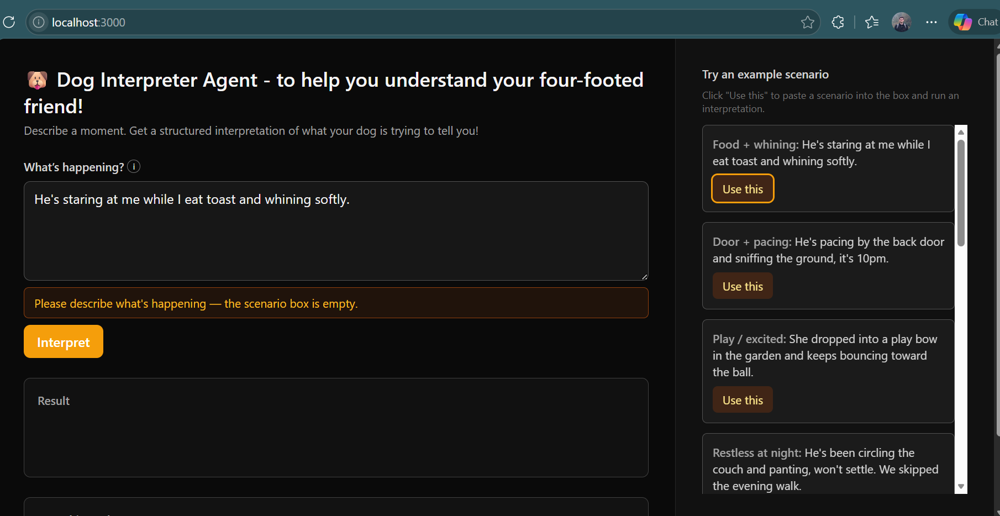
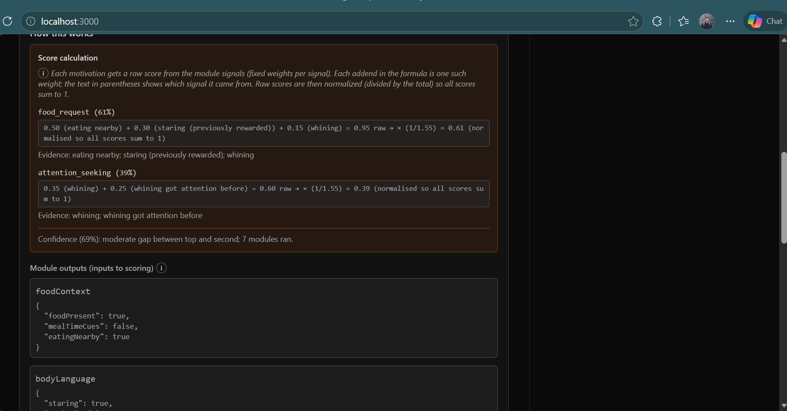
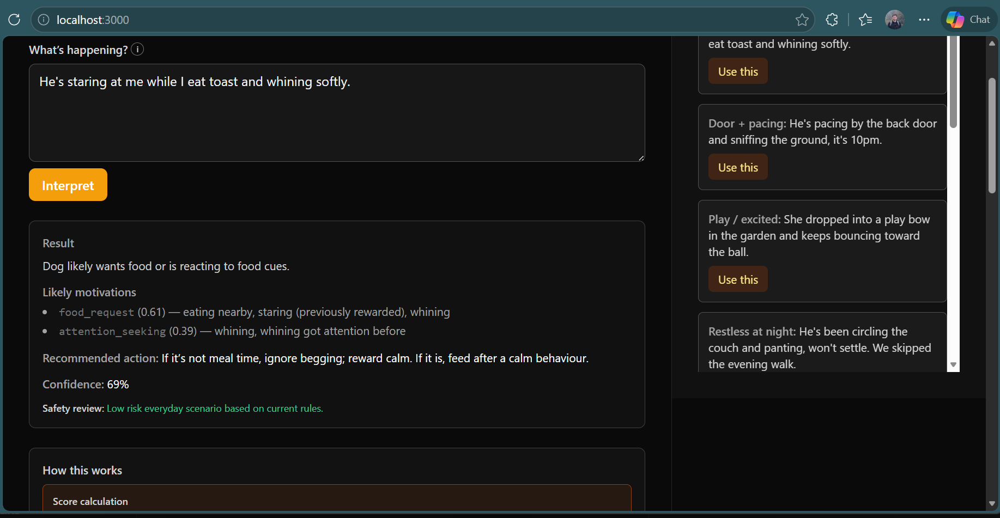

# 🐶 Dog Interpreter

> AI-native UX demo: structured reasoning, tool orchestration, and transparent outputs.

Dog Interpreter is a portfolio-focused full-stack AI project that simulates an intelligent dog behaviour analyst. You describe a moment — behaviour and context — and the system produces a structured, traceable analysis by combining:

- deterministic behaviour tools (body language, vocalisation, context signals)
- ranked motivations with confidence scoring (e.g. wants food, needs toilet, bored, alerting)
- explicit decision tracing and audit trails so every output is inspectable end-to-end

This isn't just "chatbot answers" but an **observable AI behaviour** you can inspect end-to-end.

## Screenshots

| Landing state with suggested questions | Structured result + confidence | Full tool trace / audit trail |
|---|---|---|
|  |  |  |

## What this is

Dog Interpreter is a small, portfolio-ready project that answers:

> "What is my dog trying to tell me right now?"

You describe a moment (behaviour + context), and the system produces a structured analysis:

- What signals it noticed (modules/tools)
- Ranked likely motivations (e.g. wants food, needs toilet, bored, alerting)
- A recommended human action
- A confidence score
- A visible trace of how the result was produced

This is intentionally playful - but built using serious AI-product patterns: tools, structured outputs, deterministic orchestration, and transparent UX.

## Goals

This project is designed to practice:

- **UX-for-AI**: make AI outputs legible, inspectable, and safe to act on
- **Tool/module orchestration**: explicit "systems" that produce signals
- **Structured outputs**: the UI renders from a typed result (not unstructured text)
- **Guardrail thinking**: validation, safe defaults, and clear uncertainty

## What this sample covers vs not

### Covered in this repo

- **Deterministic orchestrator**: a single `runDogInterpreter(input)` function that calls tools, scores motivations, and returns a typed `DogInterpretation`.
- **Modules as tools with clear contracts**: scenario-based modules (`foodContext`, `bodyLanguage`, `rewardMemory`, `emotionState`, `timeContext`, `locationFromScenario`, `weatherContext`) implemented as functions `(input: string) => StructuredOutput` with explicit TypeScript types and Jest tests.
- **Structured outputs + traceability**: the UI renders only from `DogInterpretation` and `trace: ModuleActivation[]`, including confidence and a confidence explanation so you can see how scores were derived.
- **Guardrails and safety agent**: an input guard for bad/off-topic scenarios plus a separate `runSafetyReview` pass in `lib/safetyAgent.ts` that reviews each interpretation for risk and surfaces a structured `SafetyReview`.
- **Testing and a small eval runner**: unit tests around tools and the orchestrator, plus `lib/evalRunner.ts` which treats the system like a classifier and reports simple top-1 accuracy on labeled scenarios.
- **First LLM-backed tool example**: `lib/llm/bodyLanguageClient.ts` shows the “LLM inside the tool, structured JSON out, orchestrator stays deterministic” pattern without changing the rest of the pipeline.
- **AI-first UI**: a Next.js + React + Tailwind interface that highlights motivations, evidence, confidence, clarifying question hints, and the full trace instead of a generic chat box.

### Not covered (left for later experiments)

- **Planner / multi-step tool loop**: there is no ReAct-style supervisor; the orchestrator is single-shot per scenario.
- **Multi-turn conversation state**: each interpretation is stateless; there is no short-term memory or chat transcript feeding back into `runDogInterpreter`.
- **Dynamic tool routing**: all scenario-based modules run on every call; there is no rule-based or LLM-based router deciding which tools to invoke.
- **Real external tools and RAG**: aside from the mocked `weatherContext`, there are no live HTTP APIs, vector databases, or knowledge-base retrieval flows.
- **Richer multi-agent patterns**: beyond the safety critic, there is no explicit planner/executor split or specialist agents; those are suggested as future extensions.
- **Production concerns**: no persistence, auth, deployment setup, metrics, feature flags, or rate limiting—this stays local and developer-focused.
- **Heavy orchestration frameworks**: no LangChain or similar; everything is wired directly in TypeScript to keep the concepts clear.

## Non-goals (Phase 1)

To keep this shippable fast:

- ❌ No RAG / vector DB
- ❌ No LangChain / heavy frameworks
- ❌ No persistence
- ❌ No auth
- ❌ No deployment (yet)
- ❌ No real LLM calls in the default interpreter pipeline (LLM-backed tools live under `lib/llm` as optional extensions)

## Core Concept: "Modules" are tools

A dog's behaviour is interpreted through a handful of internal "modules".  
In this system, each module is a tool that returns structured signals.

### Modules (Phase 1)

- 🍗 `foodContext` - is food present / food routine cues?
- 🧍 `bodyLanguage` - posture, staring, pacing, tail/ears keywords (simple rules)
- 🧠 `rewardMemory` - learned patterns (`"stare got treats before"`)
- ❤️ `emotionState` - anxiety/excitement/boredom indicators
- 🕐 `timeContext` - time-of-day and meal-time cues inferred from the scenario (e.g. "10pm", "breakfast"). Used in scoring (e.g. door + night → stronger toilet_needed). See [Learning: Adding a new tool](#learning-adding-a-new-tool) below.
- 🗺️ `locationFromScenario` - extracts a coarse location label from the scenario (`"home"`, `"garden"`, `"park"`, `"walk"`) so other tools can treat location as a simple string.
- 🌡️ `weatherContext` - **async**, mimics a temperature/weather API: takes the coarse location from `locationFromScenario`, "calls" a mocked API (delay + typed response), returns `tempC`, `isHot`, `isCold`. Used in scoring (hot → discomfort; cold + door → toilet). Demonstrates chaining (scenario → location → API) and swapping for a real API later. See **[next-steps-chaining-and-api.md](docs/next-steps-chaining-and-api.md)**.

Start with mocked outputs or keyword rules. Later, swap in an LLM for extraction while keeping the same contracts.

---

### Learning: Adding a new tool

This repo includes **`timeContext`** as an example of adding a tool without overcomplicating the system:

1. **Types** (`lib/types.ts`) - Add the new name to `ModuleName` so the trace and orchestrator stay typed.
2. **Module** (`lib/modules.ts`) - Define an output type (e.g. `TimeContextOutput`), implement a function `(input: string) => TimeContextOutput`, and register it in `MODULE_NAMES` and `MODULES`. The orchestrator will call it automatically and record input/output in the trace.
3. **Orchestrator** (`lib/interpreter.ts`) - Add the tool's output to `CollectedSignals`, pull it from the trace after the loop, and use it in `scoreMotivations` where relevant (e.g. night + door → small boost to toilet_needed).
4. **Tests** - Add unit tests for the new module's input/output; update the interpreter test to expect the new module in the trace.

The UI does not need to change: the trace panel already lists every module and its output. Adding a tool is a small, local change: one new module, a few lines in the orchestrator, and tests. Later you can replace the implementation (e.g. keyword rules → LLM or API) without changing the rest of the app.

## User Experience (what to build)

### Input

A single text box, e.g.:

> "He's staring at me while I eat toast and whining softly."

Optional quick toggles (later):

- time of day
- location (home/outside)
- meal time? (yes/no)
- walked recently? (yes/no)

### Output

- Top motivations (ranked)
- Recommended action
- Confidence meter
- Confidence explanation: short text on *why* the confidence is what it is (gap between top scores, number of modules that fired)
- Clarifying question (when confidence is low and top motivations are close): a concrete question suggesting what extra detail to add
- Trace panel: which modules ran, what they returned, and how scoring was derived

## Architecture (Phase 1)

- Next.js (App Router) + React + TypeScript
- Tailwind for UI
- Local-only state (no DB)

A deterministic orchestrator:

```ts
function runDogInterpreter(input: string): Promise<DogInterpretation>
```

The orchestrator:

- Activates modules/tools
- Collects structured signals
- Scores + ranks motivations
- Produces a typed result for the UI

## Types (source of truth)

```ts
type ModuleName =
  | "foodContext"
  | "bodyLanguage"
  | "rewardMemory"
  | "emotionState"
  | "timeContext"
  | "locationFromScenario"
  | "weatherContext";

type Motivation =
  | "food_request"
  | "toilet_needed"
  | "attention_seeking"
  | "boredom"
  | "alerting"
  | "discomfort"
  | "play";

type ModuleActivation = {
  module: ModuleName;
  input: unknown;
  output: unknown;
};

type MotivationScore = {
  motivation: Motivation;
  score: number; // 0..1
  evidence: string[]; // human-readable bullet reasons
  // Optional maths string describing how the score was calculated and normalised.
  calculation?: string;
};

type DogInterpretation = {
  summary: string;
  rankedMotivations: MotivationScore[]; // sorted desc; scores should roughly sum to 1
  recommendedHumanAction: string;
  confidence: number; // 0..1
  // Short explanation of how confidence was derived (e.g. gap between top scores, number of modules).
  confidenceExplanation?: string;
  trace: ModuleActivation[];
};
```

**Rule:** The UI renders from `DogInterpretation` only.  
No UI element should depend on unstructured text.

## Scoring (simple + deterministic)

Phase 1 scoring is intentionally **sample-sized but honest**:

- Each module returns a small set of signal flags (e.g., `foodPresent`, `staring`, `pacing`, `whining`)
- A scoring function maps signals → motivation weights
- Normalize scores to sum ~1

Confidence increases when:

- multiple modules support the top motivation
- the top score is clearly higher than #2
- fewer "unknown/missing" signals

This gives you real levers for:

- traceability
- explainability
- UX clarity

## Definition of Done (Phase 1)

Project 01 is complete when:

- ✅ Input → deterministic orchestrator → structured result
- ✅ Ranked motivations shown with evidence
- ✅ Trace panel lists modules called + outputs
- ✅ Confidence displayed and meaningfully derived
- ✅ Errors handled gracefully (empty input, unclear scenario)
- ✅ Strict TypeScript (no `any`)
- ✅ Clean, readable code and folder structure

**Input validation (bad input):** For ignoring silly, rude, or off-topic messages while staying browser-only and mocked, see **[bad-input-handling.md](bad-input-handling.md)**. That plan defines a guard before the orchestrator, a single UI-friendly contract, and mock strategies (blocklist, simple heuristics) that can be swapped for real moderation later.

## Example

**Input:**

> "He's pacing by the back door and sniffing the ground, it's 10pm."

**Output (example):**

- **Likely motivations:**
  - `toilet_needed` (0.62) - pacing + door focus + late time
  - `alerting` (0.21) - sniffing + attention shifts
  - `boredom` (0.17) - restlessness

- **Recommended action:** "Let him out briefly; keep it calm; reward toileting."

- **Confidence:** `0.74`

- **Trace:**
  - `bodyLanguage` → `{ pacing: true, doorFocus: true }`
  - `emotionState` → `{ restless: true }`
  - `foodContext` → `{ foodPresent: false }`
  - `rewardMemory` → `{ learnedDoorMeansOutside: true }`

## Future Extensions (later phases)

Only after Phase 1 is complete:

- Swap module extraction from rules → LLM (keep contracts)
- Add a "clarifying question" step if confidence < threshold (implemented as a thin helper + UI hint for low-confidence, ambiguous cases; can be extended into a full multi-turn workflow later)
- Add multi-step workflow (plan → act → observe)
- Add a second agent ("Critic/Safety") to review recommendations
- Deploy one project

## Quick Start

```bash
npm install
npm run dev
```

Open [http://localhost:3000](http://localhost:3000).  
Cursor: keep interfaces stable; start with mocks.

### Run tests

```bash
npm test
```

This repo includes **unit tests** (Jest) in `lib/__tests__/`:

- **`modules.test.ts`** - each module stub: given a scenario string, assert the structured signal output (e.g. food scenario → `foodPresent`/`eatingNearby`; door + pacing → `doorFocus`, `pacing`, `sniffing`). Locks input/output behaviour so you can refactor or swap to an LLM later without breaking contracts.
- **`interpreter.test.ts`** - full `runDogInterpreter` flow: result shape (summary, rankedMotivations, trace, confidence), scores sum correctly, example scenarios (food → top `food_request`, toilet → top `toilet_needed`), and trace contains all five modules (including `timeContext`) with input/output.

Tests are deterministic and fast; they document how the system is supposed to behave and guard against regressions when you add error handling, new motivations, or replace mocks with real tool calls.

### Small sample eval runner

Beyond unit tests, there is a tiny **eval runner** in `lib/evalRunner.ts`. It runs a handful of labeled scenarios through `runDogInterpreter` and reports how often the **top-ranked motivation** matches the expected label, plus the confidence for each case.

It is intentionally minimal; treat it as a starting point for experimenting with different hypotheses (e.g. alternative scoring, tool routing strategies, or future LLM-backed modules) by:

- **Adding more labeled scenarios** to the `EXAMPLES` array
- **Comparing variants** of the interpreter (e.g. toggles in its implementation) on the same fixed examples

You can run it via the npm script:

```bash
npm run eval
```

This uses [`tsx`](https://github.com/esbuild-kit/tsx) under the hood so it works cleanly with the project's existing TypeScript + ES module setup.

**How to use this in practice:**

- **When you change scoring or add a new hypothesis**, run `npm run eval` and check whether top-1 accuracy on the examples went up, down, or stayed flat.
- **Keep the examples stable** while comparing variants; if you create a branch that changes `runDogInterpreter` (e.g. routing logic, future LLM-backed tools), run the same eval on that branch and compare numbers before/after.
- For future stochastic tools (LLMs inside modules), you can extend the runner to **sample multiple runs per scenario** and compare *average* accuracy across strategies instead of relying on a single pass.

### Accessibility (a11y)

The UI is built for keyboard and screen-reader users: logical tab order, visible focus rings (`focus-visible`), and ARIA where it matters. Buttons have clear `aria-label`s (e.g. "Run interpretation on the scenario above"; "Use example: Food + whining. Fills the scenario box above."). The scenario input is associated with its error message via `aria-describedby` and `aria-invalid`; the error uses `role="alert"` so it's announced when it appears. The result area is a live region (`aria-live="polite"`) so new interpretations are announced without interrupting. Landmarks and sections are labelled (`main`, `aside`, `aria-labelledby` on regions) so navigation by landmark or heading is predictable. No custom widgets-native form elements and buttons keep keyboard behaviour and semantics correct by default.

**Suggested first build order:**

1. Define types + module stubs
2. Implement scoring + normalization
3. Build UI (input + results + trace)
4. Add error states + polish

## Design Principle

Stochastic reasoning belongs inside structured guardrails.  
If the system can't show what signals it used, it shouldn't pretend to know.

Even dogs deserve observability.

---

## How this relates to AI agents in real apps

This project is a **sample domain**, but the architecture and testing approach map directly to production AI/agent systems:

- **Deterministic orchestration** - The *orchestrator* (what runs, in what order, how results are combined) is fixed and testable. In real apps, the same idea applies: the agent loop, tool calls, and aggregation are code; only the *inside* of each tool (e.g. an LLM call) is stochastic. Keeping orchestration deterministic makes behaviour predictable and debuggable.

- **Structured outputs and contracts** - Here, every module returns a typed object and the final answer is a single `DogInterpretation`. In real apps, agents should produce structured data (JSON, typed objects) instead of free text. That enables validation, UI binding, logging, and safe downstream use. Contracts (types + tests) let you swap one implementation (keyword rules) for another (LLM extraction) without changing the rest of the system.

- **Trace and observability** - The trace (which modules ran, what they saw and returned) is first-class. In production, you need the same: which tools were called, with what inputs and outputs, and how that led to the final answer. That's essential for debugging, safety reviews, and user trust ("why did it say that?").

- **Confidence and guardrails** - Confidence is derived from signals (e.g. agreement across modules, score gap) and shown in the UI. In real apps, agents should expose uncertainty and have guardrails (e.g. "don't act if confidence < threshold" or "ask for clarification"). Tests can assert that low-signal inputs produce lower confidence or safe fallbacks.

- **Tests as the specification** - The unit tests here don't test the LLM; they test the *orchestration and contracts*. In real apps, you should test: tool input/output shapes, aggregation logic, confidence rules, and error handling. The stochastic part (LLM) can be mocked or tested separately (evals, golden datasets). That keeps the agent pipeline reliable and shippable.

So: **this repo is a small, testable blueprint for the kind of agent design you want in real products** - deterministic shell, typed contracts, trace, confidence, and tests around the behaviour you care about.

## Phases & progress

Tick off as you go. Only Phase 1 is in scope until it's complete.

### Phase 1 - Dog Interpreter (mocked, local)

- [x] **1.1** Scaffold app (Next.js App Router + TypeScript + Tailwind, layout with main column + trace side panel)
- [x] **1.2** Define types + module stubs (`foodContext`, `bodyLanguage`, `rewardMemory`, `emotionState`)
- [x] **1.3** Implement `runDogInterpreter`: call modules, scoring + normalization, build `DogInterpretation`
- [x] **1.4** Wire UI: input → orchestrator → show ranked motivations, evidence, action, confidence, trace
- [x] **1.5** Error handling + polish (empty input, unclear scenario, no `any`, clean structure)
- [x] **1.6** Add `timeContext` tool (learning: how to add a new tool without a new project). See [Learning: Adding a new tool](#learning-adding-a-new-tool).

**Phase 1 done when:** All 1.1-1.6 checked and [Definition of Done (Phase 1)](#definition-of-done-phase-1) satisfied.

### Phase 2 - Later (after Phase 1)

- [ ] Swap module extraction from rules → LLM (keep same contracts)
- [x] Clarifying question step when confidence < threshold (basic version: helper + UI hint)
- [x] Critic/Safety agent to review recommendations (rule-based `runSafetyReview` in `lib/safetyAgent.ts`)
- [ ] Multi-step workflow (plan → act → observe)
- [ ] Deploy

**Where we are now:** **Phase 1 complete.** All 1.1-1.6 are done. The `timeContext` tool is added as a learning example: one extra module, wired into scoring (door + night → toilet_needed), with comments in the code and tests.
