## Learning roadmap: from this project to agentic product engineering

This repo is designed as a stepping stone toward being a **product engineer on AI agent teams** (e.g. Flank-style roles): you ship usable product surfaces while understanding tools, orchestration, and safety deeply enough to collaborate with infra/ML folks.

This roadmap calls out:

- **What concepts this project already covers**
- **What to build next** to round out the "agentic applications" skill set
- **How each concept becomes a strong talking point**
- **How the architecture evolved over time**, step by step, from a single function to a richer, agentic layout.

---

## Already achieved

Think of these as **milestones in the evolving architecture**. Each diagram below shows what the system looked like at that stage, before you layered on the next concept.

1. **Deterministic orchestration**
  - `runDogInterpreter` is a fixed, testable loop: call tools, aggregate, score, return a typed result.
  - Talking point: you can design an agent *shell* as code, not prompt spaghetti.

_High-level flow at this stage:_

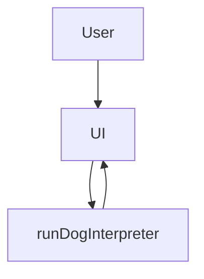

2. **Tools / modules with clear contracts**
  - Each module is a tool: `(input: string) => StructuredOutput` with explicit types and tests.
  - You’ve seen how to *add a tool* (`timeContext`, `weatherContext`) without breaking everything.
  - Talking point: you understand "tools" as functions/APIs with contracts, not just marketing jargon.

_Flow once tools are explicit modules:_

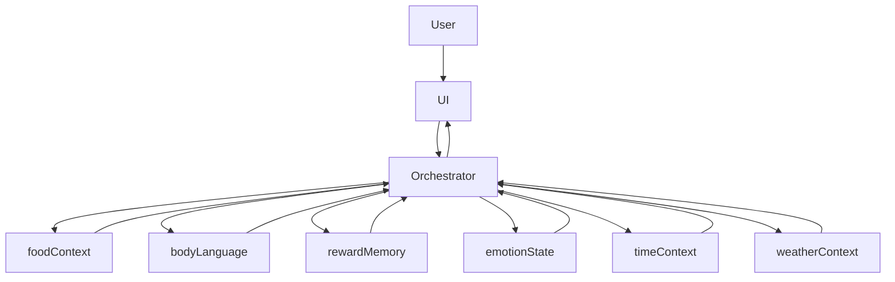

3. **Structured outputs + traceability**
  - Everything surfaces through `DogInterpretation` + `trace: ModuleActivation[]`.
  - UI renders from structure (motivations, evidence, confidence), not raw LLM text.
  - Talking point: you can design UIs that make AI **legible** and debuggable.

_Flow when results become fully structured:_

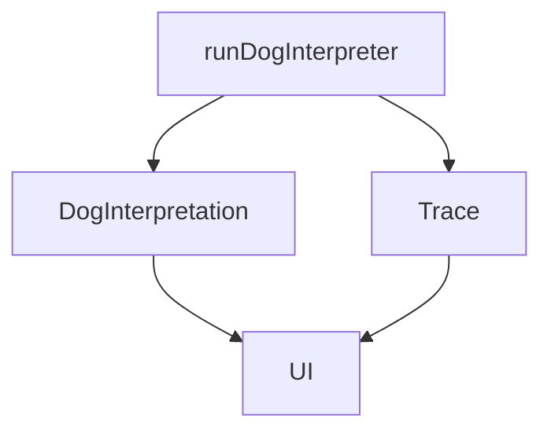

4. **Guardrails and safety thinking (Phase 1)**
  - Input guard for bad/off-topic scenarios.
  - Confidence and explainability surfaced to the user.
  - A concrete safety agent in `lib/safetyAgent.ts` that reviews the primary interpretation.
  - Talking point: you think about failure modes, not just “happy path” demos.

_Flow with input guard and safety agent added:_

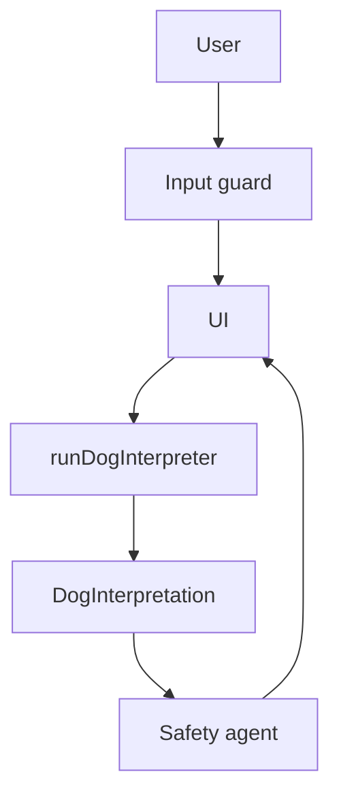

5. **Testing and eval basics**
  - Jest unit tests around tools + orchestrator.
  - A tiny eval runner `lib/evalRunner.ts` that treats the system like a classifier and scores top-1 accuracy on labeled scenarios.
  - Talking point: you know that “did it work once in dev?” is not an eval.

_Flow for the simple eval runner path:_

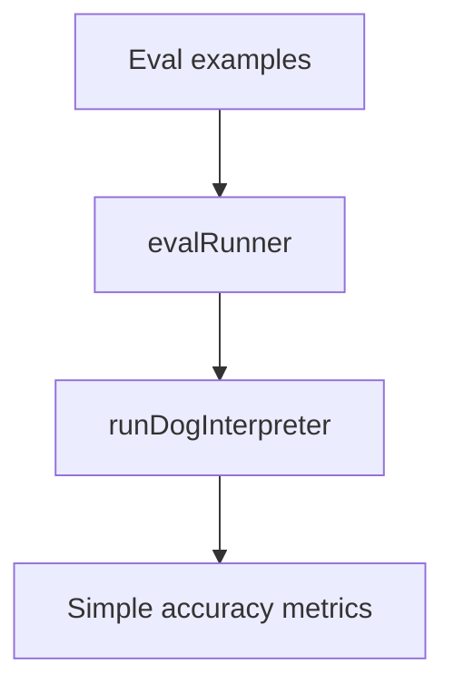

6. **First steps toward LLM-backed tools**
  - Pattern: "LLM inside the tool, structured JSON out, orchestrator stays deterministic".
  - `lib/llm/bodyLanguageClient.ts` shows how a module can call an LLM yet still honour the same contract.
  - Talking point: you see where to put LLM calls so the rest of the stack stays simple.

_Flow when a single module starts calling an LLM:_

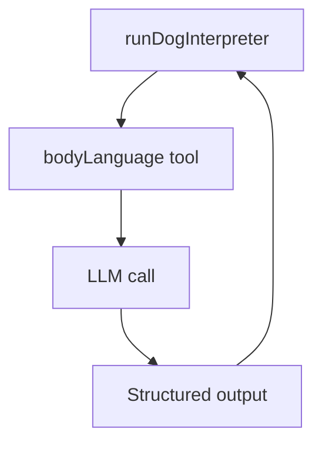

---

## Possible extensions

These are the missing pieces between this demo and what agent product teams ship day-to-day. The diagrams here are **target milestone architectures**: sketches of how the system could look once you add each idea on top of the current design.

1. **A planner + multi-step tool loop (ReAct-style)**
  - Add a "supervisor" that can:
    - Look at the current situation (scenario, trace, confidence),
    - Decide: **call a tool**, **ask the user a question**, or **return a final answer**,
    - Iterate for a few steps.
  - Start with a very small, hard-coded planner, then evolve to an LLM-driven supervisor.
  - Why it matters: most real agents are not single-shot; they loop until done.

_Target flow once a planner is added:_

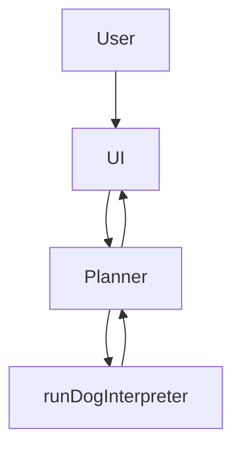

2. **Clarifying questions and user-in-the-loop workflows**
  - When confidence is low or motivations conflict, the agent should:
    - Ask a specific, minimal clarifying question (e.g. “Has your dog eaten in the last hour?”).
    - Integrate the answer into the next planning step and re-run tools.
  - Why it matters: shows you can design AI flows that feel like **products**, not just completions.

_Target flow when the planner can ask clarifying questions:_

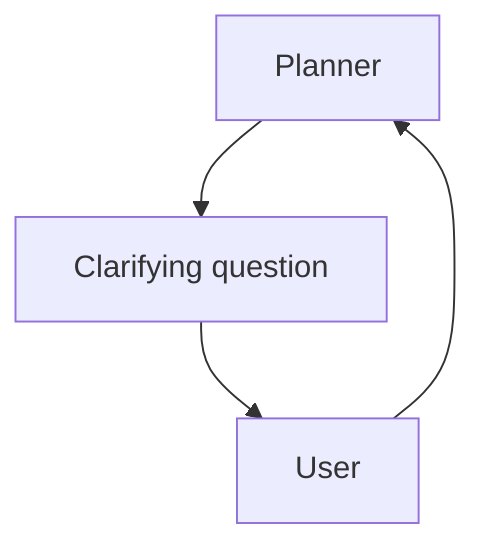

3. **Dynamic tool routing**
  - Instead of "always call all modules", introduce routing:
    - Simple rules first (if no food words → skip `foodContext`).
    - Then a small LLM-based router ("given this scenario, which tools are relevant?").
  - Why it matters: real agents must control **cost and latency**, not fan out blindly.

_Target flow when a router chooses tools per request:_

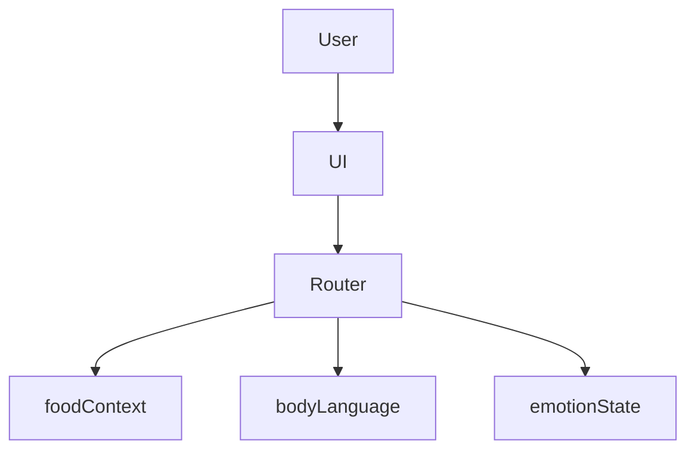

4. **Short-term memory and multi-turn interaction**
  - Support a chat-like loop where the user can:
    - Refine the scenario,
    - Ask follow-ups ("what if I ignore him?"),
    - See how the agent updates its interpretation.
  - Implement a simple in-memory conversation state: past `DogInterpretation`s + key flags.
  - Why it matters: nearly every agentic product has multi-turn state, even if there’s no full “user profile”.

_Target flow when a short term memory store is added:_

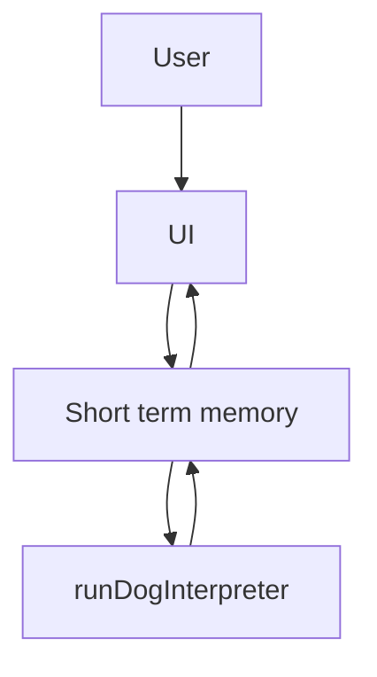

5. **External tools and RAG-lite**
  - Add at least one **real external tool**, e.g.:
    - A simple HTTP API (weather, calendar, or a tiny dog-care FAQ JSON served by your app),
    - Or a local RAG over a markdown knowledge base about dog training.
  - Keep the same pattern: tools return typed, validated outputs; orchestrator stays deterministic.
  - Why it matters: shows you can wire agents into the **outside world** safely.

_Target flow when external tools or RAG are plugged in:_

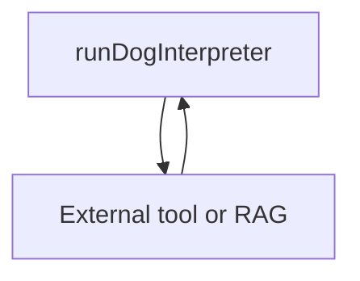

6. **Multi-agent patterns (lightweight)**
  - You already have a **safety agent** reviewing each `DogInterpretation`; deepen the pattern by:
    - Tightening its rules and evals, and wiring it clearly as a separate step in the orchestrator,
    - Exploring additional roles (e.g. planner vs executor, or specialist critics) that build on the same pattern.
  - Why it matters: maps directly to common “planner/critic/executor” patterns in modern stacks.

_Target flow when planner, primary agent, and safety agent all exist:_

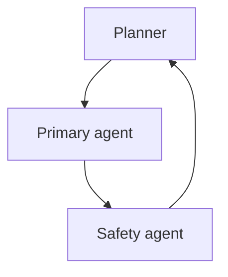

7. **Production-ish concerns**
  - Add instrumentation and configuration:
    - Simple metrics (tool calls per run, latency, error rates),
    - Feature flags or config for: which modules are LLM-backed, routing strategy, safety strictness.
  - Why it matters: this is where product engineers collaborate with platform teams to keep systems stable and observable.

_Target flow when observability and configuration are layered in:_

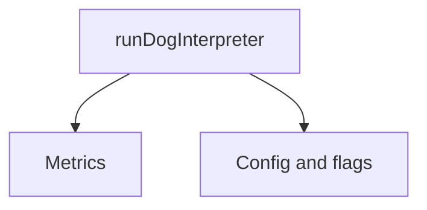

---

## 3. How to position this work when talking with others

When you talk to a someone building agents:

- **Lead with the architecture story**:
  - Deterministic orchestrator + tools + trace + evals.
  - Show that you understand where LLMs belong (inside tools, planners, critics) and where they *don’t* (UI glue, business logic).

- **Use this repo as a live artifact**
  - Walk through:
    - A module (tool) contract,
    - The interpreter/orchestrator,
    - The safety guard and confidence,
    - The eval runner and how you’d use it to compare new agent strategies.

- **Talk about “next steps” concretely**
  - Be ready to say: "Here’s how I’d add a planner loop + clarifying questions + routing, using the same structure you see here."
  - This shows you can **grow** an agent system responsibly rather than bolting on prompts.

If you build even one or two of the “next concepts” above into this project, you’ll have a portfolio piece that demonstrates not just that you can use LLM APIs, but that you can **design and ship agentic products** the way serious teams do.

