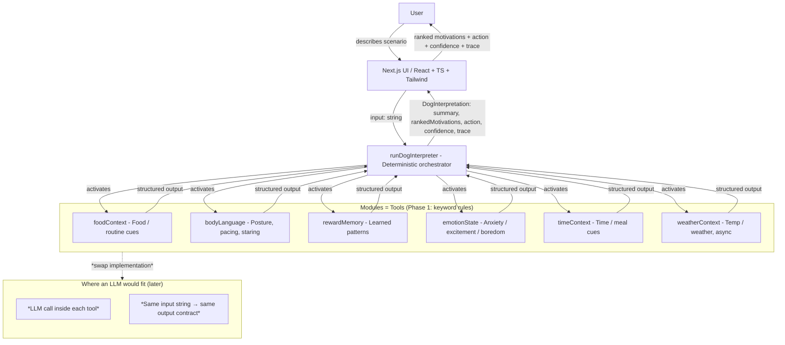

# How this works (Phase 1)

This document describes the **Phase 1** architecture of the **Dog Interpreter**: a deterministic orchestration layer that activates mocked “modules” (tools), aggregates structured signals, scores motivations, and returns a single typed `DogInterpretation` object that drives the UI.

**This repo is a learning tool.** It’s meant to help people — especially those new to AI agents — see how agents are built: what a “tool” is, how an orchestrator works, and why structure and trace matter. Use this doc and the code together; the FAQs below answer the kinds of questions that come up when you’re new to this.

## Goals (Phase 1)

- **Deterministic orchestration** around scenario input
- **Explicit module activation** (never implied)
- **Structured outputs only** — UI renders from typed `DogInterpretation` (no raw text)
- **Traceability** via a `trace: ModuleActivation[]` (which modules ran, input/output)

## Key Components

- **UI (Next.js / React / Tailwind)**: scenario input, renders ranked motivations, recommended action, confidence, and trace panel
- **Orchestrator (`runDogInterpreter`)**: activates modules, collects signals, runs scoring + normalization, builds `DogInterpretation` (including `trace` and `confidence`)
- **Modules (mocked tools)**: `foodContext`, `bodyLanguage`, `rewardMemory`, `emotionState`, `timeContext`, `weatherContext` — each returns structured signal flags (`weatherContext` is async and mimics a temperature/weather API; see [next-steps-chaining-and-api.md](next-steps-chaining-and-api.md))
- **Types**: `ModuleName`, `Motivation`, `ModuleActivation`, `MotivationScore`, `DogInterpretation` (see README)

## Architecture Diagram



The *LLM sits inside each module/tool*, not in the orchestrator. You keep the same function signature (e.g. `bodyLanguage(input: string) => BodyLanguageOutput`). Today that’s keyword rules; later you call an LLM with a prompt like “From this scenario, extract body-language signals: staring, pacing, doorFocus, whining, tailUp, sniffing. Return JSON.” The orchestrator stays deterministic and never sees raw model output — only the structured result.

## Data Flow (High Level)

1. **Scenario input** enters the UI as a single text string.
2. *(Optional)* UI runs an **input guard** (see [bad-input-handling.md](bad-input-handling.md)): reject empty, rude, or clearly off-topic input; show a single friendly message without echoing the input. If allowed, continue.
3. UI calls **`runDogInterpreter(input)`**.
4. Orchestrator:
   - **Activates all Phase 1 modules** (all six tools), passes input to each.
   - **Collects structured outputs**; records each as `ModuleActivation { module, input, output }` in `trace`.
   - **Maps signals → motivation weights**; normalizes so scores sum ~1.
   - **Computes confidence** (e.g. agreement across modules, gap between top and #2).
   - Builds **`DogInterpretation`**: `summary`, `rankedMotivations` (with `evidence`), `recommendedHumanAction`, `confidence`, `trace`.
5. UI renders:
   - **Ranked motivations** (motivation + score + evidence)
   - **Recommended action**
   - **Confidence** (always visible)
   - **Trace panel**: modules called + their input/output

## Where an actual LLM would fit

- *Inside each tool, not in the orchestrator.* The orchestrator stays pure logic: call tools, aggregate, score, return a typed object. It never parses free text from a model.
- *Each module keeps the same contract:* `(input: string) => StructuredOutput`. For `bodyLanguage`, you’d send the scenario to an LLM with a system prompt that defines the JSON shape (e.g. `{ staring, pacing, doorFocus, whining, tailUp, sniffing }`). You validate the response (e.g. with Zod) and return it. The rest of the pipeline is unchanged.
- *Optional: one LLM for “routing”.* A more advanced setup could use a first LLM call to decide *which* tools to invoke (e.g. “no food mentioned → skip foodContext”). The orchestrator would still call only those tools and then run the same scoring logic. Tool selection becomes data (e.g. `["bodyLanguage", "emotionState"]`) instead of “call all six”.
- *Summary and recommended action* could stay rule-based (as now) or be generated by an LLM from the ranked motivations + evidence, again with a strict schema so the UI still receives a `DogInterpretation`, not raw text.

## How this gets more advanced: tools and flows

This toy uses **one-shot, all-tools-called** flow. Real agent systems often add:

1. **Tools = same modules, different implementations**
   - Each “module” is a **tool**: same name, same input/output contract. Phase 1: keyword rules. Later: LLM extraction, or an external API (e.g. image model for “what’s in this photo?”), or a RAG lookup. The orchestrator only sees the structured result; it doesn’t care how the tool was implemented.

2. **Selective tool use**
   - Instead of “always run all six modules”, the orchestrator (or a small “planner” LLM) decides *which* tools to call for this input. Example: user says “she’s whining by the door” → call `bodyLanguage`, `emotionState`, `rewardMemory`; maybe skip `foodContext`. Fewer calls = cheaper and faster, and the trace still shows exactly which tools ran.

3. **Chained tools**
   - One tool’s output can be another tool’s input. Example: `bodyLanguage(scenario)` returns signals; a second tool “recommend_action(motivations, signals)” takes that plus the ranked motivations and returns the recommended action string. The orchestrator runs the chain and records each step in the trace. **In this repo:** `weatherContext` demonstrates an async, API-like tool that internally chains “extract location from scenario” → “call weather API”; see [next-steps-chaining-and-api.md](next-steps-chaining-and-api.md).

4. **Supervisor / ReAct-style loop**
   - A “supervisor” LLM repeatedly decides: “call tool X” or “I have enough, return final answer”. It calls tools, gets back structured results, and either loops or formats a final response. Our pipeline is a single round (orchestrator → all tools → aggregate); a supervisor adds multiple rounds and dynamic tool choice. The **trace** is the same idea: log every tool call and result so the flow is inspectable.

5. **Structured outputs everywhere**
   - No matter how many LLMs you add, every tool and the final answer should return **typed, validated** data (e.g. Zod schemas). That keeps the UI, logging, and guardrails (e.g. “don’t show action if confidence < 0.5”) simple and reliable.

So: this toy gives you the **orchestrator + tool contracts + trace + confidence** pattern. Making it “more advanced” means swapping tool implementations (e.g. LLM inside each module), optionally adding routing or a supervisor, and keeping the same structured-output and trace discipline.

## Phase 1 Constraints (Intentional)

- **No external APIs**; all modules are mocked (keyword rules or fixed outputs; `weatherContext` mimics an API with delay + typed response).
- **No RAG / vector DB / LangChain**
- **No persistence, auth, deployment**
- **Type safety**: no `any`; UI driven only by `DogInterpretation`

---

## FAQs (for people new to AI agents)

### What is a “tool”?

A **tool** is a small, single-purpose function that the agent (or orchestrator) can call. It takes a defined input and returns a **structured** output — not a paragraph of text, but something the rest of the system can use (e.g. a list of booleans, a label, a number).

**Example in this project:** The `bodyLanguage` tool takes the user’s scenario string (e.g. *“He’s pacing by the door and whining”*) and returns an object like:

```json
{ "staring": false, "pacing": true, "doorFocus": true, "whining": true, "tailUp": false, "sniffing": false }
```

The orchestrator doesn’t care *how* that object was produced (keyword rules today, an LLM tomorrow). It only cares that it gets that shape back so it can combine it with other tools and score motivations. So: **a tool = a named function with a clear input/output contract.** The agent “uses” tools by calling them and then deciding what to do with the results.

### What is an “orchestrator”?

The **orchestrator** is the part that decides what to run and in what order, then combines the results. In this project it’s `runDogInterpreter`: it calls every tool once with the same scenario string, collects all the structured outputs, runs scoring logic (e.g. “door + pacing + night → toilet_needed”), and returns one final object (summary, ranked motivations, recommended action, confidence, trace). It never talks to an LLM directly; it only calls tools and does math. So the “brain” that coordinates things is deterministic code; the *tools* are where you’d plug in an LLM or an API later.

### What is the “trace” and why does it matter?

The **trace** is a log of every tool the orchestrator called, plus the input and output for each. In the UI you see it as “Trace” (e.g. `bodyLanguage` → `{ pacing: true, doorFocus: true }`). It matters because (1) you can debug why the system said what it said, (2) you can show the user “here’s what we looked at,” and (3) in real products, audits and safety reviews need to see exactly what ran. Agents that don’t expose a trace are harder to trust and harder to fix.

### What’s the difference between “tools” and “an LLM”?

An **LLM** (large language model) is a single big model that generates text (or structured output if you prompt it carefully). A **tool** is a function you define: input in, structured output out. In many agent designs, *each tool might call an LLM inside it* — for example, `bodyLanguage(scenario)` could send the scenario to an LLM with the prompt “Extract body-language signals and return JSON.” So: the LLM does the heavy lifting *inside* the tool; the orchestrator only sees the tool’s return value. That keeps the rest of the system simple and testable. In this project we don’t use a real LLM; we use keyword rules inside each tool to mimic that pattern.

### How do I know where to add a new tool?

Ask: “Is there a distinct kind of signal or lookup that the system needs, with a clear input and output?” Examples: “What time of day is it?” → `timeContext`. “Is food involved?” → `foodContext`. “What’s the dog’s body language?” → `bodyLanguage`. Each of those is one tool. You add it by (1) defining its output type, (2) implementing a function that returns that type, (3) registering it in the orchestrator’s list of tools, and (4) using its output in your scoring or logic. The README’s [Learning: Adding a new tool](README.md#learning-adding-a-new-tool) section walks through this with `timeContext`.
